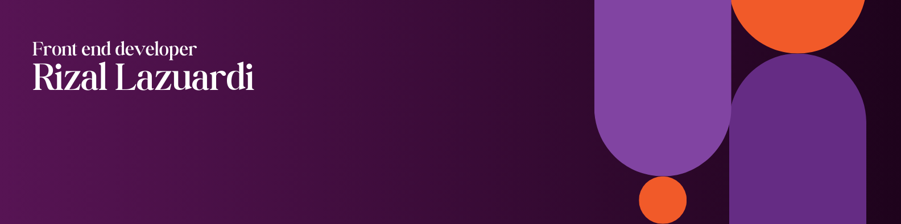

<!-- 🎨 Custom Banner -->

  

<h1 align="center">Hey, I'm [Your Name] 👋</h1>

✨ Creative Front-Stack Developer who loves building colorful UI with React, TypeScript, Tailwind, PHP & beyond.

---

<!-- 🧩 Animated Intro -->

  

---

### 🔧 Tech Stack

  

---

### 🎯 Live Demo

> 🧪 Curious how I build stuff? Check out one of my colorful playgrounds hosted on Vercel!

  

---

### 📬 Contact Me

  
  

---

> ✨ "I write code like I paint – with lots of colors and a touch of chaos."

